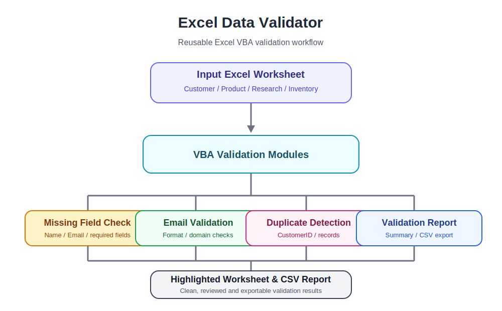

# Excel Data Validator

Cross-platform Excel VBA toolkit for customer data validation, issue reporting, and CSV export.

Designed for both **Windows** and **macOS**, with platform-specific export workflows for maximum reliability.

---

## Architecture



---

## Features

✓ Required Field Validation

✓ Email Format Validation

✓ Duplicate Detection

✓ Validation Summary Report

✓ CSV Validation Report Export

✓ Windows / macOS Support

✓ English + Japanese Source Code Comments

✓ Modular VBA Design

---

## Supported Platforms

| Platform | Status |
|----------|--------|
| Windows | ✅ Fully Supported |
| macOS | ✅ Supported |

---

## CSV Export

### Windows

The CSV validation report is automatically exported as UTF-8 to the same folder as the workbook.

Example:

```
validation_report_20260719_073000.csv
```

---

### macOS

Due to Excel for macOS sandbox and file-access restrictions, the native **Save As** dialog is used.

Recommended workflow:

1. Save the file in your **Downloads** folder.
2. Select:

```
CSV UTF-8 (Comma delimited) (.csv)
```

3. After saving, open your Downloads folder to locate the exported report.

This design provides the most reliable experience across different versions of Excel for macOS.

---

## Project Structure

```
Excel-Data-Validator
│
├── modules
│   ├── Validation.bas
│   ├── Dashboard.bas
│   ├── ProductValidation.bas
│   ├── ResearchValidation.bas
│   ├── InventoryValidation.bas
│   └── CsvExport.bas
│
├── images
│   └── architecture.svg
│
├── examples
│   ├── sample_customer_data.csv
│   ├── sample_product_data.csv
│   ├── sample_research_data.csv
│   └── sample_inventory_data.csv
│
├── Excel-Data-Validator.xlsm
│
├── LICENSE
└── README.md
```

---

## Sample Validation Report

| Row | Issue Type | Column | Value |
|----:|------------|---------|-------|
| 3 | Missing | Name | |
| 4 | Missing | Email | |
| 5 | Invalid | Email | invalid-email |

---

## Development Principles

- Architecture First
- Cross-platform compatibility
- English naming conventions
- English + Japanese comments
- Modular VBA design
- Excel Table friendly
- GitHub portfolio ready

---

## Roadmap

### v1.0

- Stable cross-platform release
- Improved Dashboard
- Validation performance improvements

### Future Ideas

- Multi-sheet validation
- Custom validation rules
- Localization
- HTML validation report
- PDF export
- Power Query integration

---

## License

MIT License
